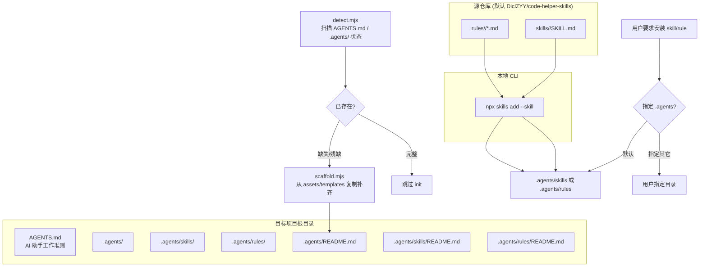

# AI Agents Installer

把当前项目初始化为「符合 AGENTS.md + `.agents/` 行业标准」的 AI 编程助手工作区，并按需从仓库拉取 skill / rule。

- 标准与目录结构：[references/agents-standard.md](references/agents-standard.md)
- 命令与故障排查：[references/installer-commands.md](references/installer-commands.md)
- 模板文件：[assets/templates/AGENTS.md.tpl](assets/templates/AGENTS.md.tpl)、[assets/templates/agents-readme.md.tpl](assets/templates/agents-readme.md.tpl)、[assets/templates/skills-readme.md.tpl](assets/templates/skills-readme.md.tpl)、[assets/templates/rules-readme.md.tpl](assets/templates/rules-readme.md.tpl)
- 检测与生成脚本：[scripts/detect.mjs](scripts/detect.mjs)、[scripts/scaffold.mjs](scripts/scaffold.mjs)

## When to use

**适用：**

- 第一次给项目接入 AI 编程助手（Cursor / Claude / Trae 等），需要落地 AGENTS.md + `.agents/` 标准
- 已有项目里 AGENTS.md / `.agents/` 缺失或残缺，需要补齐骨架
- 想把仓库 `DiclZYY/code-helper-skills` 里的某个或某些 skill / rule 安装到项目中，并放进 `.agents/skills` / `.agents/rules`
- 用户给出「在项目里装一下这个 skill」类需求，且当前项目尚未配套 `.agents/` 骨架

**不适用：**

- 仓库自身的 skill / rule 维护（在 `code-helper-skills` 仓内编辑 `skills/<name>/SKILL.md` 本身）
- 用户明确指定其它目录（如 `.cursor/`、`.claude/`）作为 AI 工具集落点，本 skill 仍可执行 init，但需要明确告知偏离 `.agents/` 默认
- 仅想在终端临时查看 / 调用某个 skill 而不需要持久化到项目

## Core pattern



### 标准布局

| 路径 | 作用 | 是否必建 |
|------|------|----------|
| `AGENTS.md` | AI 助手在项目中的工作准则（位置、语言、约束） | 是 |
| `.agents/` | AI 助手配置根目录 | 是 |
| `.agents/README.md` | 目录说明与维护约定 | 是 |
| `.agents/skills/` | 已安装 skill 落点（项目级） | 是 |
| `.agents/rules/` | 已安装 rule 落点（项目级） | 是 |
| `.agents/skills/README.md` | skills 子目录索引骨架 | 是 |
| `.agents/rules/README.md` | rules 子目录索引骨架 | 是 |

`.agents/` 下**不再**保留 `skills-npm` 风格的 `node_modules/.skills/<name>` 结构，而是直接把 skill 文件同步进 `.agents/skills/<name>/`。如确需保留 `node_modules/.skills/`（例如在 Cursor 中让 `npx skills` 自动发现），按 [references/installer-commands.md](references/installer-commands.md#可选-node_modulesskills-保留) 处理。

### 默认源仓库

- 仓库名：`DiclZYY/code-helper-skills`
- 安装方式：`npx skills add <repo> --skill <name>`
- 用户可在执行时临时指定其它仓库，例如 `npx skills add antfu/skills --skill xxx`，仍落到 `.agents/skills/<name>/`

### Skill 与 Rule 的区分

| 类型 | 触发方式 | 内容特征 | 落点 |
|------|----------|----------|------|
| **skill** | 按 description 触发词按需加载 | 解决某类问题的完整方法论 + checklist + 模板 | `.agents/skills/<name>/SKILL.md` + 可选 `references/` `assets/` `scripts/` |
| **rule** | 始终生效，常驻上下文 | 硬约束 / 编码规范 / 强制工作流 | `.agents/rules/<name>/*.md`（一组围绕同一框架的硬约束文件） |

`npx skills add` 默认装的是 skill；rule 需要从源仓库的 `rules/<name>/` 直接拷贝到 `.agents/rules/<name>/`。

## Implementation checklist

### 1. 检测项目状态

执行 `node scripts/detect.mjs`（或自行实现等价扫描）：

- [ ] 项目根是否存在 `AGENTS.md`
- [ ] 是否存在 `.agents/` 目录
- [ ] 是否存在 `.agents/skills/`、`.agents/rules/`、`README.md`
- [ ] 是否存在 `.agents/skills/README.md`、`.agents/rules/README.md`
- [ ] 给出 `missing` / `partial` / `ready` 三档结论

完整检测脚本见 [scripts/detect.mjs](scripts/detect.mjs)。

### 2. 生成缺失的骨架（仅写缺失项）

按检测结果**只写缺失文件**，不要覆盖已有内容：

- `AGENTS.md` → 复制 [assets/templates/AGENTS.md.tpl](assets/templates/AGENTS.md.tpl)，替换占位符
- `.agents/README.md` → [assets/templates/agents-readme.md.tpl](assets/templates/agents-readme.md.tpl)
- `.agents/skills/README.md` → [assets/templates/skills-readme.md.tpl](assets/templates/skills-readme.md.tpl)
- `.agents/rules/README.md` → [assets/templates/rules-readme.md.tpl](assets/templates/rules-readme.md.tpl)

`AGENTS.md.tpl` 包含以下占位符，生成时**必须**替换：

| 占位符 | 含义 | 示例 |
|--------|------|------|
| `{{PROJECT_NAME}}` | 项目名（package.json 的 `name` 字段或目录名） | `admin-pro-core` |
| `{{PRIMARY_LANG}}` | 主要使用语言 / 框架 | `Vue2 + Laravel` |
| `{{REPO_DEFAULT}}` | 默认 skill/rule 源仓库 | `DiclZYY/code-helper-skills` |
| `{{DATE}}` | 初始化日期（YYYY-MM-DD） | `2026-07-15` |

生成脚本见 [scripts/scaffold.mjs](scripts/scaffold.mjs)。

### 3. 安装 skill

```bash
npx skills add {{REPO_DEFAULT}} --skill <skill-name>
```

- 默认目标目录：`.agents/skills/<skill-name>/`
- 若用户指定 `--to` / 自定义路径，记录到 `AGENTS.md` 的「已安装工具集」一节
- 安装后**确认** `.agents/skills/<skill-name>/SKILL.md` 的 frontmatter `name` 与目录名一致

### 4. 安装 rule

`npx skills` 不直接覆盖 rule，需从源仓库 `rules/` 拷贝：

```bash
# 从源仓库下载指定 rule（一次性）
npx degit {{REPO_DEFAULT}}/rules/<rule-name> .agents/rules/<rule-name>
```

或克隆后 `cp -r`。`.agents/rules/<rule-name>/` 下应是 `README.md` + 一组分类子 `.md`。

### 5. 更新 `AGENTS.md` 的「已安装工具集」

在 `AGENTS.md` 中追加（不要覆盖原有内容）：

```markdown
## 已安装工具集

- 源仓库：{{REPO_DEFAULT}}
- 初始化日期：{{DATE}}

### Skills

- `<skill-name>` — <一句话用途>

### Rules

- `<rule-name>` — <一句话硬约束主题>
```

### 6. 后续默认

完成 init 后，**所有后续 skill / rule 安装默认走 `.agents/skills/`、`.agents/rules/`**；除非用户在执行时显式声明其它落点。每次安装后回写 `AGENTS.md` 的「已安装工具集」列表。

## Anti-patterns

- 把 skill 装到 `node_modules/.skills/` 后**不**同步到 `.agents/skills/`，导致项目提交到 git 后别的协作者 AI 助手看不到
- 覆盖用户已有的 `AGENTS.md`，丢失项目既有约定
- 把所有 skill 全装到一个扁平目录，丢失 `references/` `assets/` `scripts/` 的子目录结构
- 把 rule 当 skill 装（`npx skills add` 不适用于硬约束型 rule）
- 在 `AGENTS.md` 写「所有约束」后仍让 `.agents/skills/` 与 `.agents/rules/` 缺失 → 工具集只挂在 AGENTS.md，AI 助手无法按 description 触发
- 跨平台时忽略 PowerShell 与 `npx degit` 的差异（见 [references/installer-commands.md](references/installer-commands.md#跨平台注意)）
- 把 `code-helper-skills` 的仓库地址写死成 `code-helper`（仓库名是 `code-helper-skills`），导致 `npx skills add` 找不到
- 不回写 `AGENTS.md` 的「已安装工具集」，后续接手者无法快速知道项目挂了哪些 skill / rule

## Cross-platform notes

- macOS / Linux 直接用 `npx` + `cp -r`
- Windows PowerShell 用 `Copy-Item -Recurse` 代替 `cp -r`；`degit` 在 PowerShell 下需注意参数转义
- `npx skills add` 自带跨平台 shim，但若 `.agents/` 路径含空格或中文，先做路径 quote

## Additional resources

- [references/agents-standard.md](references/agents-standard.md) — AGENTS.md + `.agents/` 行业标准来源与字段含义
- [references/installer-commands.md](references/installer-commands.md) — `npx skills add` / `npx degit` 命令、跨平台、故障排查
- [assets/templates/AGENTS.md.tpl](assets/templates/AGENTS.md.tpl) — 根 `AGENTS.md` 模板
- [assets/templates/agents-readme.md.tpl](assets/templates/agents-readme.md.tpl) — `.agents/README.md` 模板
- [assets/templates/skills-readme.md.tpl](assets/templates/skills-readme.md.tpl) — `.agents/skills/README.md` 模板
- [assets/templates/rules-readme.md.tpl](assets/templates/rules-readme.md.tpl) — `.agents/rules/README.md` 模板
- [scripts/detect.mjs](scripts/detect.mjs) — 检测项目当前 AGENTS.md + `.agents/` 状态
- [scripts/scaffold.mjs](scripts/scaffold.mjs) — 仅写缺失骨架文件
